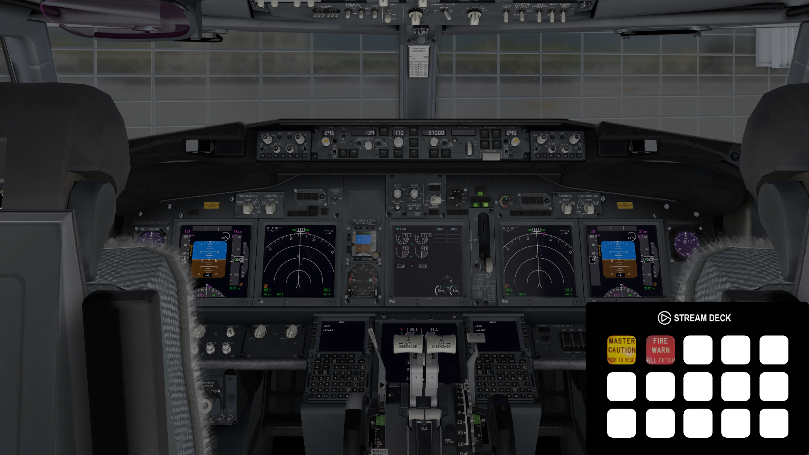

<link rel="shortcut icon" type="image/x-icon" href="githubimage.png">

[](https://github.com/ThatTom/Airdeck)

### What is Airdeck?

Airdeck is a tool designed to allow XPlane simulator enthusiasts with an Elgato Streamdeck the chance to make a fully customised configuration with integration into the simulator with little experience in programming or design skill (Like me). This was originally created as a small project to allow interaction from my Streamdeck into XPlane 11 after starting to take the simulator more seriously and soon realised that this could be used by so many more Virtual Pilots. I will be planning to update the script greatly in the future and any suggestions/concerns are greatly received. Airdeck has also been designed to allow for one person to create the functionality and design and then share it with others very easily. At the time of writing this, the Airdeck currently requires NodeJS and as a result, would require it to be installed however I hope to make the process of using the Airdeck even easier in the future and currently instructions are provided below for the full install and setup of everything required.

##### Libaries used

* [ExtPlaneJs](https://github.com/wadedos/ExtPlaneJs)
* [node-elgato-stream-deck](https://github.com/Lange/node-elgato-stream-deck)

### Included Airdeck Functions

Airdeck currently includes 6 functions in total these are: Single, Single Hold, Dual, Dual Varible, Folder and Aircraft. Each has it's own function to allow for full customisation.

##### Single

The single function is used for commands which you want to run when the key is pressed for example cutting the fuel supply or activating the altitude hold on the autopilot. This will only run the entered command on the key down function to prevent the command being run twice inside of XPlane.

``` 
"{KEY ID 0 - 14}":
{
  "image": "{Image Loocation}",
  "type": "single",
  "function": "{Command you wish to run in XPlane}"
 }
 ```

##### Single Hold

The single hold function is used for commands which you want to run when the key is pressed or held for example the ingnition switch in the C172, although I plan on making a single command work when pushed or not this is the best way at the moment to reduce the risk of a single command being pressed twice.

``` 
"{KEY ID 0 - 14}":
{
  "image": "{Image Loocation}",
  "type": "singlehold",
  "function": "{Command you wish to run in XPlane}"
 }
 ```
 
##### Dual

The dual function is used when a single button requires two functions, for example, a light switch or battery switch. The function allows for two commands to be assigned and two images assigned for each on and off states. The state also toggles each time the key is pressed.

``` 
"{KEY ID 0 - 14}":
{
  "type": "dual",
  "state": "{Default State On/Off}",

  "on":
  {
      "function": "{Command you wish to run in XPlane}",
      "image": "{Off State Image Loocation}",
  },
  "off":
  {
      "function": "{Command you wish to run in XPlane}",
      "image": "{On State Image Loocation}",
  }
}
 ```
### Known Issues

Known issues will be added here was found/reported and will be resolved as soon as possible
